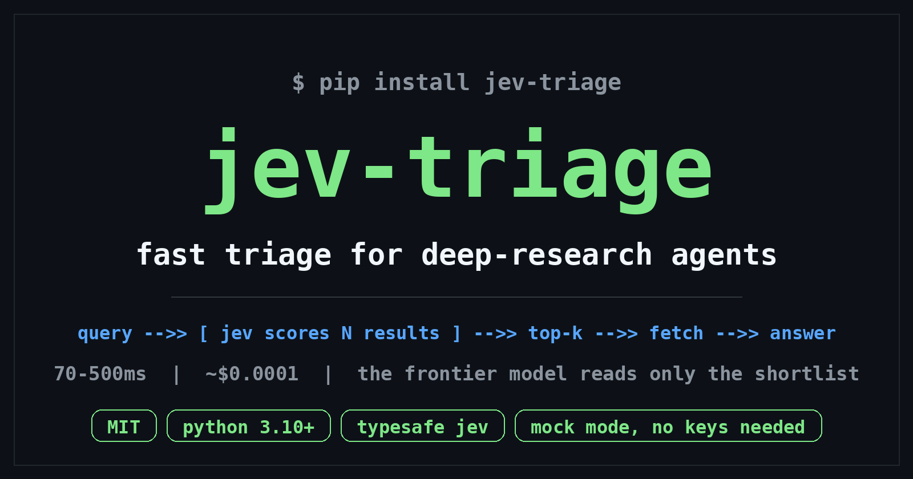

<p align="center">
  
</p>

<p align="center">
  <a href="README.zh-CN.md">中文</a> | <b>English</b>
</p>

<p align="center">
  <a href="LICENSE"></a>
  
  
</p>

# jev-triage

**Triage for deep-research agents.** Score N search results in one parallel TypeSafe Jev call, so the frontier model only reads what is worth reading.

## Why

The expensive part of deep research is not *searching*, it is *reading*: fetching 10 full pages and stuffing them into a frontier model is slow and costly. Usually only 3 of the 10 are worth reading. Who picks? Traditionally, another frontier-model call, which costs even more.

Jev was built for exactly this kind of "fast thinking": scoring 10 search results takes **one parallel call, 70-500ms, about $0.0001**. The triage nurse is on duty; the ER (frontier-model attention) only sees real patients.

## Architecture

```
query -> [frontier: plan] -> search API -> [jev-triage: 1 call, N scored] -> top-k
      -> fetch -> [gate: page_has_answer?] -> [frontier: extract]
      -> [gate: enough_to_answer?] -> loop | [frontier: synthesize]
```

Division of labor ("fast hands, slow brain"): Jev handles navigation (which link, is this page useful, should we keep searching); the frontier model handles cognition (planning, close reading, synthesis).

## Quickstart

```bash
pip install -e .            # no keys needed: mock mode
pip install -e ".[jev]"     # real Jev via official typesafe-sdk
export TYPESAFE_API_KEY=... # required for real mode

python examples/quickstart.py
python tests/test_triage_mock.py
```

```python
from jev_triage import JevClient, triage

tr = triage("Jev API pricing", results, top_k=3)  # results from Tavily/Exa/Brave
for it in tr.top_k:
    print(it.score, it.confidence, it.title)
```

`examples/research_loop.py` is a runnable minimal research-loop skeleton (bring your own search/fetch functions).

## Validate first, trust later

The load-bearing assumption of this project: **Jev's top-k ≈ the frontier model's top-k**. Run the evals before believing it:

```bash
python -m evals.agreement --data evals/sample_queries.jsonl --judge mock  # no-key smoke test
python -m evals.agreement --data my_queries.jsonl                        # real eval: needs TYPESAFE_API_KEY + judge key
```

Green-light bar: top-k overlap >= 0.85. See `evals/README.md` for details.

## Honest notes

- Jev is in early access; the vendor's performance numbers are self-reported. Run `evals/` yourself for this project's numbers.
- Mock mode is a keyword heuristic for pipeline development only; it says nothing about real quality.
- This project does not solve search-index coverage: you still need a search API (Tavily / Exa / Brave).

## Roadmap

- [x] `triage()` + noul gates + agreement eval harness
- [ ] Adapters: drop-in triage for GPT Researcher / deer-flow
- [ ] Standing research: 24/7 topic watch with Jev as gatekeeper
- [ ] Hosted triage API (paid convenience layer)
